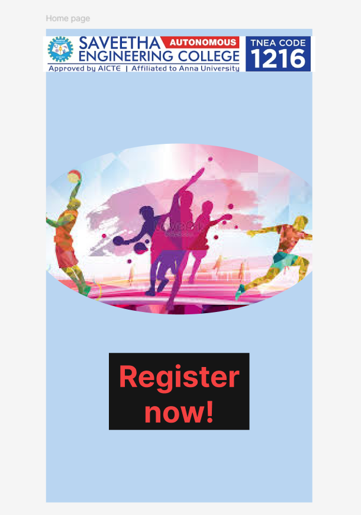

# Ex09 Event Registration Web Application
# Date:25/11/24
# AIM:
To design, develop and deploy a web application for event registration.

# DESIGN STEPS:
## Step 1:
Create a new frame.

## Step 2:
Select any one preset size of your choice.

## Step 3:
Select the shapes you need.

## Step 4:
Import images as needed.

## Step 5:
Create pages based on your need and link them.

## Step 6:
Validate the HTML and CSS code.

## Step 6:
Publish the website in the given URL.

# DESIGN TOOL:
Figma

# CODE:
```
Home page

<div className="HomePage" style={{width: 360, height: 640, position: 'relative', background: '#B9D5F1'}}>
  <div className="Rectangle1" style={{width: 190, height: 104, left: 85, top: 438, position: 'absolute', background: '#151515'}} />
  
  <div className="RegisterNow" style={{width: 190, height: 104, left: 85, top: 445, position: 'absolute', textAlign: 'center', color: '#F44141', fontSize: 40, fontFamily: 'Inter', fontWeight: '700', wordWrap: 'break-word'}}>Register now!</div>
</div>
```
```
sports day event page
<div className="SportsDayEvents" style={{width: 378, height: 666, paddingTop: 75, paddingLeft: 91, paddingRight: 62, backgroundImage: 'url(https://via.placeholder.com/378x666)', flexDirection: 'column', justifyContent: 'flex-end', alignItems: 'center', display: 'inline-flex'}}>
  <div className="CricketBadmintonVolleyBall100Mts200mts400mts4100RelayKhoKhoKabaddi" style={{width: 225, height: 611, color: '#140505', fontSize: 36, fontFamily: 'Jaini Purva', fontWeight: '400', wordWrap: 'break-word'}}>cricket<br/>Badminton<br/>Volley Ball<br/>100 MTS<br/>200MTS<br/>400MTS<br/>4-100 Relay<br/>kho -kho<br/>kabaddi<br/><br/><br/><br/></div>
</div>
```
```
event register form
<div className="EventRegistrationForm" style={{width: 360, height: 640, position: 'relative', backgroundImage: 'url(https://via.placeholder.com/360x640)'}}>
  <div className="EventRegistrationForm" style={{width: 262, height: 85, left: 40, top: 7, position: 'absolute', textAlign: 'center', color: 'black', fontSize: 36, fontFamily: 'Jaro', fontWeight: '400', wordWrap: 'break-word'}}>Event registration form<br/></div>
  <div className="FillTheDetails" style={{width: 228, height: 21, left: 48, top: 104, position: 'absolute', textAlign: 'center', color: 'black', fontSize: 16, fontFamily: 'Inter', fontWeight: '500', wordWrap: 'break-word'}}>fill the details</div>
  <div className="Rectangle1" style={{width: 217, height: 30, left: 48, top: 162, position: 'absolute', background: '#D9D9D9'}} />
  <div className="Rectangle2" style={{width: 173, height: 27, left: 49, top: 222, position: 'absolute', background: '#D9D9D9'}} />
  <div className="Rectangle3" style={{width: 202, height: 25, left: 49, top: 279, position: 'absolute', background: '#D9D9D9'}} />
  <div className="Frame1" style={{width: 100, height: 100, left: 304, top: 368, position: 'absolute'}} />
  <div className="Rectangle4" style={{width: 176, height: 23, left: 49, top: 334, position: 'absolute', background: '#D9D9D9'}} />
  <div className="Rectangle6" style={{width: 169, height: 23, left: 48, top: 378, position: 'absolute', background: '#D9D9D9'}} />
  <div className="Rectangle7" style={{width: 161, height: 25, left: 49, top: 422, position: 'absolute', background: '#D9D9D9'}} />
  <div className="Rectangle8" style={{width: 171, height: 28, left: 51, top: 482, position: 'absolute', background: '#D9D9D9'}} />
  <div className="Rectangle9" style={{width: 174, height: 22, left: 51, top: 541, position: 'absolute', background: '#D9D9D9'}} />
  <div className="FullName" style={{width: 211, height: 22, left: -20, top: 174, position: 'absolute', textAlign: 'center', color: 'black', fontSize: 15, fontFamily: 'Inter', fontWeight: '300', wordWrap: 'break-word'}}>Full Name</div>
  <div className="Gender" style={{width: 155, height: 23, left: 0, top: 226, position: 'absolute', textAlign: 'center', color: 'black', fontSize: 15, fontFamily: 'Inter', fontWeight: '300', wordWrap: 'break-word'}}>Gender</div>
  <div className="Age" style={{width: 166, height: 15, left: -18, top: 279, position: 'absolute', textAlign: 'center', color: 'black', fontSize: 15, fontFamily: 'Inter', fontWeight: '300', wordWrap: 'break-word'}}>Age</div>
  <div className="ResisterNumber" style={{width: 173, height: 11, left: 20, top: 334, position: 'absolute', textAlign: 'center', color: 'black', fontSize: 15, fontFamily: 'Inter', fontWeight: '300', wordWrap: 'break-word'}}>Resister Number</div>
  <div className="Department" style={{width: 154, height: 18, left: 20, top: 383, position: 'absolute', textAlign: 'center', color: 'black', fontSize: 15, fontFamily: 'Inter', fontWeight: '300', wordWrap: 'break-word'}}>Department</div>
  <div className="MobileNumber" style={{width: 142, height: 19, left: 40, top: 425, position: 'absolute', textAlign: 'center', color: 'black', fontSize: 15, fontFamily: 'Inter', fontWeight: '300', wordWrap: 'break-word'}}>Mobile Number</div>
  <div className="EmailId" style={{width: 157, height: 9, left: 53, top: 487, position: 'absolute', textAlign: 'center', color: 'black', fontSize: 15, fontFamily: 'Inter', fontWeight: '300', wordWrap: 'break-word'}}>Email ID</div>
  <div className="EventsToRegister" style={{width: 152, height: 10, left: 48, top: 543, position: 'absolute', textAlign: 'center', color: 'black', fontSize: 15, fontFamily: 'Inter', fontWeight: '300', wordWrap: 'break-word'}}>Events To Register</div>
  <div className="Rectangle10" style={{width: 160, height: 29, left: 180, top: 598, position: 'absolute', background: '#703FF8'}} />
  <div className="Submit" style={{width: 135, height: 20, left: 191, top: 598, position: 'absolute', textAlign: 'center', color: 'white', fontSize: 24, fontFamily: 'Inter', fontWeight: '800', wordWrap: 'break-word'}}>Submit</div>
</div>
```
```
contact page
<div className="ContactPage" style={{width: 360, height: 640, position: 'relative', backgroundImage: 'url(https://via.placeholder.com/360x640)'}}>
  <div className="ThankYou" style={{width: 253, height: 32, left: -39, top: 22, position: 'absolute', textAlign: 'center', color: 'black', fontSize: 32, fontFamily: 'Jersey 10', fontWeight: '400', wordWrap: 'break-word'}}>Thank you</div>
  <div className="WeAreAllEagerlyWaitingForYourParticiapteInTheSportsEvents" style={{width: 187, height: 49, left: 27, top: 77, position: 'absolute', textAlign: 'center', color: 'black', fontSize: 14, fontFamily: 'Joan', fontWeight: '400', wordWrap: 'break-word'}}>We are all eagerly waiting <br/>for your particiapte in the <br/>sports events</div>
  <div className="EMailSaveethaengineeringcollegeGmailComPhone63691833946369183346" style={{width: 311, height: 33, left: 0, top: 594, position: 'absolute', textAlign: 'center', color: 'white', fontSize: 14, fontFamily: 'Joan', fontWeight: '400', wordWrap: 'break-word'}}>E-mail:saveethaengineeringcollege@gmail.com<br/>phone:6369183394,6369183346<br/></div>
  <div className="ContactUs" style={{width: 232, height: 41, left: -18, top: 553, position: 'absolute', textAlign: 'center', color: 'black', fontSize: 40, fontFamily: 'Jersey 10', fontWeight: '400', wordWrap: 'break-word'}}>contact us:</div>
</div>
```

# OUTPUT:



# RESULT:
The program to design, develop and deploy a web application for event registration is completed successfully.
